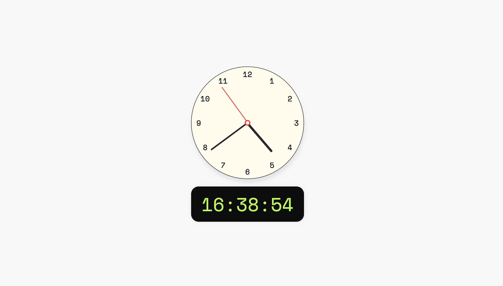

# James Aspinall | Frontend Developer

Email: james@disi.au

Mobile: 0423 567 498

Website: [disi.au](https://disi.au)

GitHub: [jamaspy](https://github.com/jamaspy).

LinkedIn: [James Aspinall](https://www.linkedin.com/in/jamesaspinall/).

---

# Clocks Coding Challenge

## Viewing Project

To view the project please run `npm install` and then `npm start` in the root directory.

## Approach

I have made a custom `useClock` hook that helps me out with both the Digital and Analogue clock data. The digital clock is relatively simple, just returning me the `new Date()` state every second. The analogue clock was a little more tricky having to convert the time into degrees for the hands to rotate.

**Analogue Clock**

The analogue clock hands move by passing the returned state for the seconds, minutes and hours and transforming the hand by the degrees after setting `transform-origin: bottom` to simulate it "rotating" around the red pin.

For the numbers I have mapped over and array of the hours and then changed their absolute position to put them around the face. I knew what I was trying to do but I did ask google for the math here :/ hope thats OK!

**Digital Clock**

The digital clock is relatively simple. The only gotcha I found was to prepend the numbers less than 10 with a 0 and to use a `mono font` to keep the numbers aligned when changing.

## Thank you
